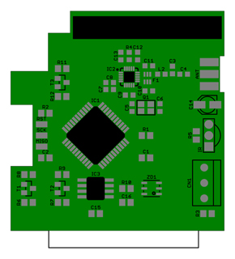
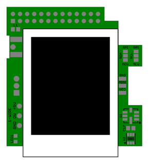

Add-On Board
============

A small PCB for Raspberry Pi and home automation with [FHEM](http://fhem.de/fhem.html).

- CC1101 RF transceiver (868MHz) with ATmega644V co-processor
- DS2482 I2C to 1-Wire bridge device with 5V to 3.3V level shifter
- ST7735R based 1.8" TFT Display (128x160)
- TSOP4838 IR receiver
- BMP085 barometric pressure sensor
- TSL2561 digital luminosity / lux / light sensor
- ISP header

Please refer to:
- [FHEM](http://fhem.de/fhem.html)
- [Linux Framebuffer drivers for small TFT LCD display modules](https://github.com/notro/fbtft/wiki)
